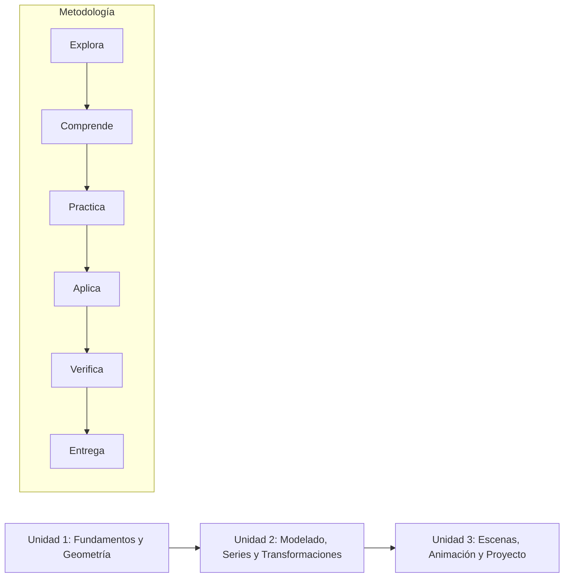

# Computación Gráfica (UTP)

Repositorio oficial para las actividades, talleres y proyectos de la asignatura **Computación Gráfica** de la Universidad Tecnológica de Pereira (UTP).

---

## 🎯 Presentación y Propósito del Curso

El curso desarrolla competencias para **modelar, visualizar y programar soluciones gráficas computacionales mediante Python**. A lo largo de la materia se abordan temas fundamentales de geometría computacional, álgebra lineal aplicada, transformaciones en 2D y 3D, representación de objetos y curvas, construcción de escenas interactivas y técnicas modernas de renderizado y visualización.

### Resultados de Aprendizaje de la Asignatura (RAA)

- **RAA1:** Aplicar álgebra vectorial y transformaciones geométricas en la representación de objetos e imágenes.
- **RAA2:** Construir representaciones y visualizaciones computacionales utilizando Python, NumPy y Matplotlib.
- **RAA3:** Desarrollar interfaces y escenas gráficas que integren interacción, eventos y elementos visuales.
- **RAA4:** Integrar animación, simulación y control gráfico en proyectos de aplicación.
- **RAA5:** Probar, documentar y comunicar desarrollos gráficos mediante lenguaje técnico y evidencias verificables.
- **RAA6:** Aprender de forma autónoma nuevas herramientas gráficas, actuando con pensamiento crítico y responsabilidad académica.

---

## 🗺️ Ruta de Aprendizaje



1. **Unidad 1: Fundamentos y Geometría Computacional**
   - Fundamentos del lenguaje Python y preparación del entorno científico.
   - Álgebra vectorial, sistemas de coordenadas, matrices con NumPy y visualización con Matplotlib.
2. **Unidad 2: Modelado Numérico, Curvas y Transformaciones**
   - Aproximación de funciones continuas y curvas mediante **Series de Taylor**.
   - Primitivas gráficas 2D/3D y algoritmos de rasterización.
   - Matrices de transformación afín (traslación, rotación, escala, cizallamiento).
   - Tratamiento básico de imágenes y mapas de bits.
3. **Unidad 3: Interfaces, Escenas, Animación y Simulación**
   - Construcción de escenas gráficas, proyección en perspectiva e iluminación básica.
   - Animación matemática, interpolación y simulación física simple.
   - Proyecto integrador final.

---

## 📊 Sistema de Evaluación

| Periodo | Actividades Principales | Peso en el Periodo | Aporte a la Nota Final |
| :--- | :--- | :---: | :---: |
| **1.º Periodo (30 %)** | Talleres prácticos (40 %) / Examen parcial (60 %) | 40 % / 60 % | **12 % / 18 %** |
| **2.º Periodo (35 %)** | Talleres de modelado y código (40 %) / Proyectos (60 %) | 40 % / 60 % | **14 % / 21 %** |
| **3.º Periodo (35 %)** | Proyecto integrador final | 100 % | **35 %** |

---

## 📂 Estructura del Repositorio

```text
computacion-grafica/
├── README.md                                 # Guía general de la asignatura
├── unidad-1-fundamentos-y-geometria/         # Prácticas de vectores, matrices y primeras gráficas
│   └── README.md
├── unidad-2-modelado-y-transformaciones/     # Series, curvas y transformaciones geométricas
│   ├── README.md
│   └── taller-7-series-de-taylor/            # Taller 7: Series de Taylor y Error
│       ├── taller_7_series_taylor.py         # Código ejecutable del taller
│       ├── codigo_base_clase.py              # Transcripción del código visto en clase
│       └── explicacion_linea_por_linea.md    # Explicación pedagógica detallada línea a línea
└── unidad-3-escenas-y-animacion/             # Escenas 3D, animación y proyecto final
    └── README.md
```

---

## ⚙️ Requisitos Técnicos y Ejecución

- **Python:** 3.9 o superior.
- **Librerías principales:** `numpy`, `matplotlib`.

### Instalación de dependencias:

```bash
# Crear y activar entorno virtual
python3 -m venv .venv
source .venv/bin/activate  # En Linux/macOS
# .venv\Scripts\activate   # En Windows

# Instalar librerías
pip install numpy matplotlib
```

### Ejecutar un taller (ejemplo Taller 7):

```bash
python3 unidad-2-modelado-y-transformaciones/taller-7-series-de-taylor/taller_7_series_taylor.py
```

---

## ⚖️ Integridad Académica

Todo el código entregado debe ser de autoría propia o debidamente atribuido. Las herramientas de apoyo y fragmentos referenciados deben documentarse en los comentarios y documentación técnica asociada. El estudiante debe estar en plena capacidad de sustentar conceptualmente cada línea de código desarrollada.
